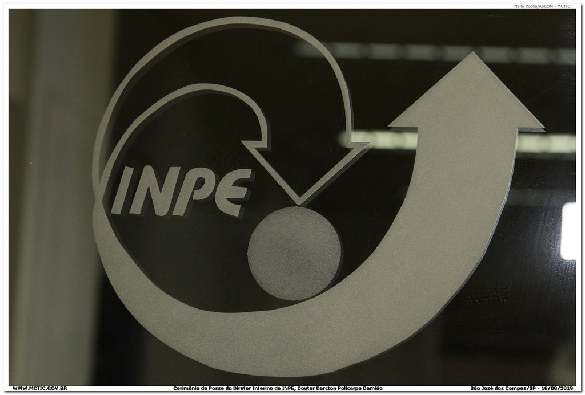
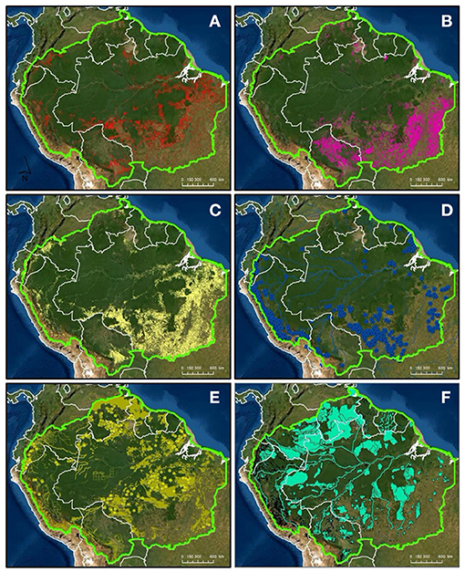
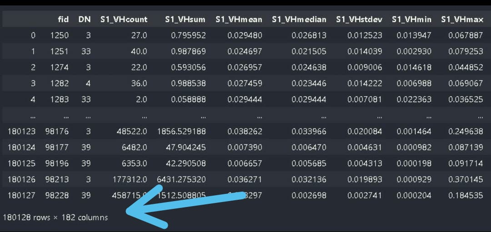
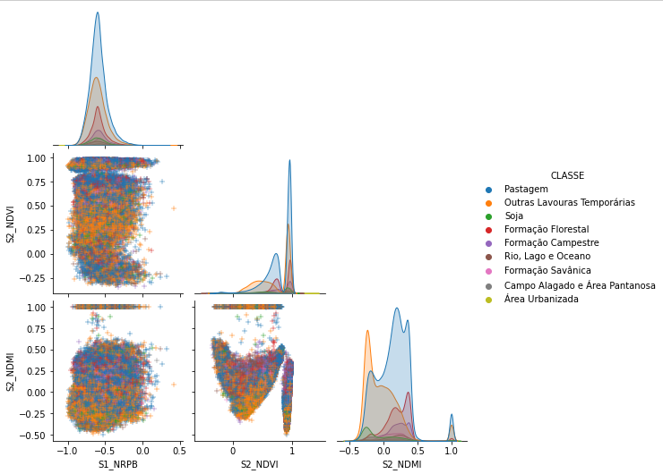

# <a href="https://github.com/vicssb/Artificial-intelligence/blob/main/readme.md">  Artificial-intelligence </a>
Artificial intelligence in INPE - 2022

  
 
## Análise de dados estatísticos dos satelites Sentinel 1 e 2 para classificação de cobertura e uso do solo na regiao Amazônica
 
As informações de uso e cobertura da Terra são de
elevada importância para uma sociedade bem estrutura, uma 
vez que auxiliam órgãos de gestão ambiental e desenvolvimento 
agropecuário a identificar regiões de desmatamento e avanço de 
urbanização, bem como áreas naturais que devem ser protegidas. 
O projeto MapBiomas, utiliza-se de imagens de satélite e da 
tecnologia da informação para processar e classificar a cobertura 
da Terra, informando e disponibilizando as transformações no 
território brasileiro anualmente. A versão mais recente disponibilizada pelo projeto, denominada coleção 6, utiliza-se de dados estatísticos em diversas frequências de ondas, captadas pelos instrumentos do satelite LANDSAT, e produz uma classificação com acurácia aproximada de 97% para a região de estudo. 
Este trabalho visa a análise exploratória de atributos estatísticos
dos satélites Sentinel-1 e Sentinel-2 a fim de analisar a possibilidade de classificação do uso e cobertura da Terra, em uma região especifica, através de uma Rede Neural Artificial (RNA), utilizando dados da coleção 6 do MapBiomas como parâmetro de referencia o que possibilitaria o monitoramento das mudanças em um período de tempo mais curto
 
 
## Tecnologia 
 
Aqui estão as tecnologias usadas neste projeto
 
* Python com as seguintes bibliotecas:
    - import os                                                # PARA COMANDOS DO SISTEMA
    - import pandas as pd                                      # PARA MANIPUTACAO DE DADOS CSV
    - import numpy as np                                       # PARA OPERACOES MATEMATICAS (sqrt, abs,...)
    - import matplotlib.pyplot as plt                          # PARA PLOT DE GRAFICOS
    - import seaborn as sns                                    # PARA PLOT DE GRAFICOS
    - from pickle import dump                                  # Para salvar arquivos
    - import cv2                                               # Para trabalhar com imagens
    - from google.colab import files                           # Para baixar os arquivos
    - import zipfile                                           # Para zipar arquivos
    - import itertools
    - import random

    - from sklearn.utils import shuffle                        # PARA EMBARALHAR OS DADOS
    - from sklearn.model_selection import train_test_split     # PARA SEPARAR OS DADOS (TREINO,TESTE)
    - from sklearn import preprocessing                        # Para preprocessar os dados
    - from sklearn.decomposition import PCA                    # Para preprocessar os dados
    - from sklearn.metrics import multilabel_confusion_matrix  # Para plotar a matriz de confusão
    - from sklearn.metrics import confusion_matrix             # Para plotar a matriz de confusão
    - from sklearn.utils import class_weight                   # Para aplicar pesos a cada classe

    - import tensorflow as tf                                # PARA REDES NEURAIS
    - from tensorflow import keras                           # PARA REDES NEURAIS
    - from keras.utils.vis_utils import plot_model           # PARA REDES NEURAIS
    - from keras import layers                               # PARA REDES NEURAIS
    - from keras.callbacks import ModelCheckpoint            # PARA SALVAR OS PESOS DA REDE NEURAL
    - from google.colab import data_table                    # PARA FORMATAÇÃO DAS TABELAS DO COLAB

 
 
## Serviços usados
 
* Google Colab Notebook
 
 
## Como usar
 
Abra o Google Colab Notebooks: https://colab.research.google.com/notebooks/

 
## Resultados
 

 
 
 
## Conclusão

Considerando a distribuição do conjunto de dados após 
as correções, uma diferença elevada entre as classes ainda
permanece, o que indica a necessidade de obtenção de mais
amostras das classes em menor quantidade, esse desbalanceamento pode prejudicar, por exemplo a separação das classes.
Nossa conclusao é que os dados disponibilizados apresentam correlação com 
o objeto de estudo e podem ser utilizados para classificação, 
porem a baixa quantidade de determinadas amostras pode vir 
a prejudicar a acuracia do classificador.
 
 
## Links
 
  - Paper: https://github.com/vicssb/Artificial-intelligence/blob/main/Analise%20de%20dados%20estatisticos%20dos%20satelites%20Sentinel%201%20e%202%20para%20classificac%C2%B8ao%20de%20cobertura%20e%20uso%20do%20solo%20na%20Amazonia.pdf
  
  - Repositório: https://github.com/vicssb/Artificial-intelligence.git
    - Em caso de bugs sensíveis, como vulnerabilidades de segurança, entre em contato
      diretamente em vez de usar o rastreador de problemas. Valorizamos o seu esforço
      para melhorar a segurança e privacidade deste projeto!
 
 
## Versão
 
1.0.0.0
 
 
## Autores
 
* **Luís Nascimento, Rogerio Batista e Victor Barros**: 

- @vicssb (https://github.com/vicssb)
- {luis.esnascimento, rogbatista, vicssb}@gmail.com
 
Por favor, siga o github e junte-se a nós!
Obrigado por me visitar e boa codificação!
