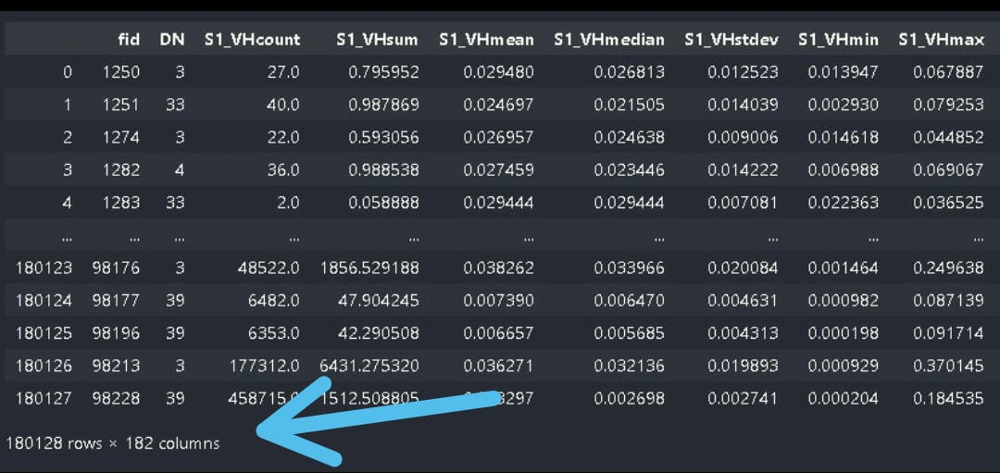
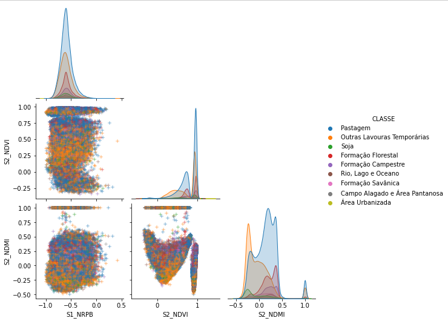

# <a href="https://github.com/vicssb/IA/readme.md">  Artificial-intelligence </a>

# <a href="https://github.com/vicssb/IA/leiame.md">  Inteligência Artificial </a>

Artificial intelligence in INPE - 2022

  
 
## Analysis of statistical data from Sentinel 1 and 2 satellites for land cover and land use classification in the Amazon region
 
Land use and land cover information are of high importance for a well-structured society, as they help environmental management and agricultural development agencies to identify regions of deforestation and advancing urbanization, as well as natural areas that must be protected. The MapBiomas project uses satellite images and information technology to process and classify the Earth's coverage, informing and making available the transformations in the Brazilian territory annually. The most recent version made available by the project, called collection 6, uses statistical data in different wave frequencies, captured by the LANDSAT satellite instruments, and produces a classification with an accuracy of approximately 97% for the study region. This work aims at the exploratory analysis of statistical attributes of Sentinel-1 and Sentinel-2 satellites in order to analyze the possibility of classifying the use and land cover, in a specific region, through an Artificial Neural Network (ANN), using data from collection 6 of MapBiomas as a reference parameter, which would allow the monitoring of changes in a shorter period of time.
 
 
## Technology 
 
Here are the technologies used in this project.
 
* Python with the following libraries:
    - import os # FOR SYSTEM COMMANDS
    - import pandas as pd # FOR CSV DATA HANDLING
    - import numpy as np # FOR MATHEMATICAL OPERATIONS (sqrt, abs,...)
    - import matplotlib.pyplot as plt # FOR GRAPHICS PLOT
    - import seaborn as sns # FOR GRAPHICS PLOT
    - from pickle import dump # To save files
    - import cv2 # To work with images
    - from google.colab import files # To download the files
    - import zipfile # To zip files
    - import itertools
    - import random

    - from sklearn.utils import shuffle # TO SHUFFLE DATA
    - from sklearn.model_selection import train_test_split # TO SEPARATE THE DATA (TRAINING, TEST)
    - from sklearn import preprocessing # To preprocess the data
    - from sklearn.decomposition import PCA # To preprocess the data
    - from sklearn.metrics import multilabel_confusion_matrix # To plot the confusion matrix
    - from sklearn.metrics import confusion_matrix # To plot the confusion matrix
    - from sklearn.utils import class_weight # To apply weights to each class

    - import tensorflow as tf # FOR NEURAL NETWORKS
    - from tensorflow import keras # FOR NEURAL NETWORKS
    - from keras.utils.vis_utils import plot_model # FOR NEURAL NETWORKS
    - from keras import layers # FOR NEURAL NETWORKS
    - from keras.callbacks import ModelCheckpoint # TO SAVE NEURAL NETWORK WEIGHTS
    - from google.colab import data_table # FOR FORMATTING COLAB TABLES

 
 
## Services Used
 
* Google Colab Notebook
 
 
## How to use
 
Open Google Colab Notebooks: https://colab.research.google.com/notebooks/
 
## Results
 
 
 
 
 
## Links
 
  - Paper: https://github.com/vicssb/AI/blob/master/Analise%20de%20dados%20estatisticos%20dos%20satelites%20Sentinel%201%20.pdf
  
  - Repository: https://github.com/vicssb/IA.git
    - In case of sensitive bugs like security vulnerabilities, please contact
      YOUR EMAIL directly instead of using issue tracker. We value your effort
      to improve the security and privacy of this project!
 
 
## Versioning
 
1.0.0.0
 
 
## Authors
 
* **Luís Nascimento, Rogerio Batista e Victor Barros**: 

- @vicssb (https://github.com/vicssb)
- {luis.esnascimento, rogbatista, vicssb}@gmail.com
 
Please follow github and join us!
Thanks to visiting me and good coding!
